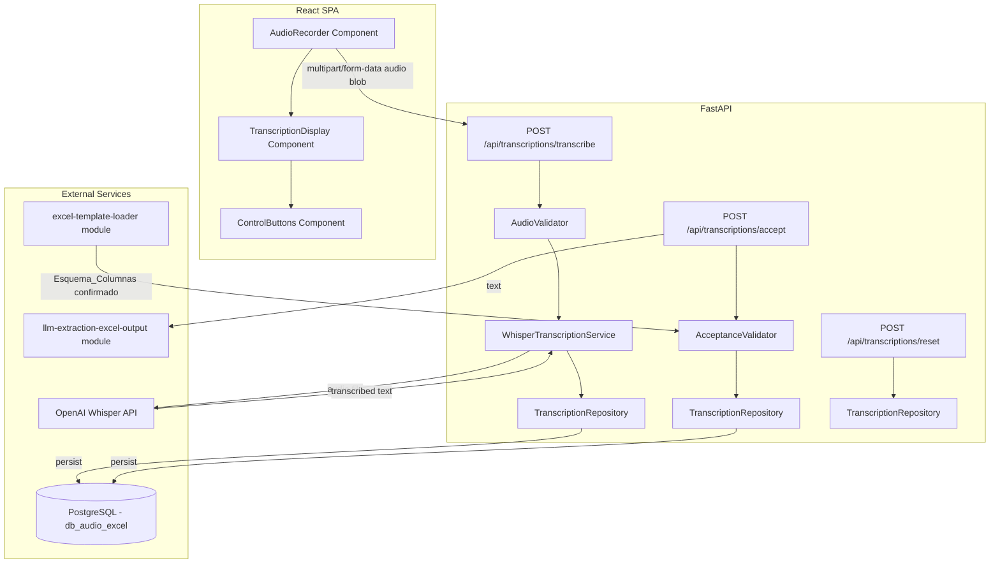
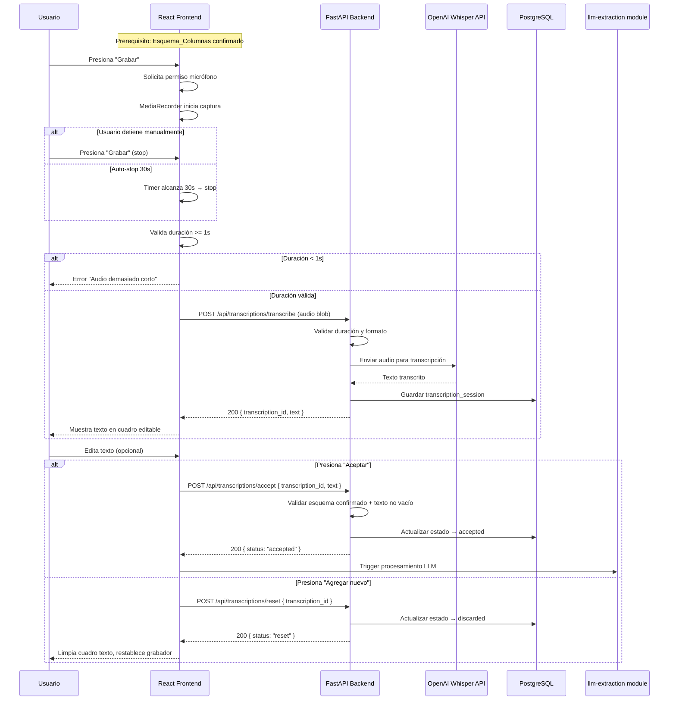

# Design Document — audio-transcription-controls

## Overview

Este módulo gestiona la grabación de audio del usuario desde el micrófono del navegador, el envío del audio al backend para su transcripción mediante OpenAI Whisper API, y los controles de flujo (Aceptar / Agregar nuevo) que conectan este módulo con el siguiente (`llm-extraction-excel-output`).

### Flujo principal

1. El usuario presiona "Grabar" en el frontend React.
2. El navegador solicita permiso de micrófono (si no fue concedido) y comienza a capturar audio con la MediaRecorder API.
3. El usuario detiene la grabación (o se auto-detiene a los 30 segundos).
4. El frontend envía el blob de audio al backend como `multipart/form-data`.
5. El backend valida la duración (mínimo 1s, máximo 30s) y envía el audio a OpenAI Whisper API.
6. Whisper retorna el texto transcrito; el backend lo persiste en PostgreSQL y lo devuelve al frontend.
7. El usuario puede editar el texto transcrito en un cuadro de texto editable.
8. "Aceptar" envía el texto al módulo `llm-extraction-excel-output`.
9. "Agregar nuevo" limpia el texto y restablece el grabador para una nueva iteración.

### Decisiones clave de diseño

- **MediaRecorder API** en el frontend para captura de audio (soporte nativo en navegadores modernos, sin dependencias externas).
- **Formato de audio**: `audio/webm;codecs=opus` como formato preferido (eficiente, soportado por Whisper). Fallback a `audio/ogg` si webm no está disponible.
- **El audio NO se persiste en disco ni en base de datos**: se procesa en memoria y se descarta tras la transcripción.
- **El texto transcrito sí se persiste** en PostgreSQL como parte de la sesión de transcripción, para trazabilidad y para permitir el envío al módulo downstream.
- **Validación de duración**: se realiza tanto en frontend (UX inmediata) como en backend (seguridad).
- **OpenAI Whisper API** (`whisper-1`) para la transcripción. Modelo único, sin configuración de idioma (auto-detect).
- Se reutiliza el patrón de sesión del módulo `excel-template-loader` (UUID, estados, timestamps).

## Architecture



### Flujo de datos



## Components and Interfaces

### Backend Components

#### 1. `AudioValidator` (service)

Valida el audio recibido antes de enviarlo a Whisper.

```python
class AudioValidator:
    MIN_DURATION_SECONDS = 1.0
    MAX_DURATION_SECONDS = 30.0
    ALLOWED_MIME_TYPES = {"audio/webm", "audio/ogg", "audio/mp4", "audio/mpeg", "audio/wav"}

    def validate(self, file: UploadFile, duration: float) -> ValidationResult:
        """Valida MIME type y duración del audio."""
        ...
```

#### 2. `WhisperTranscriptionService` (service)

Orquesta la llamada a OpenAI Whisper API.

```python
class WhisperTranscriptionService:
    MODEL = "whisper-1"

    async def transcribe(self, audio_file: bytes, mime_type: str) -> str:
        """Envía el audio a Whisper API y retorna el texto transcrito."""
        ...
```

#### 3. `AcceptanceValidator` (service)

Valida las precondiciones para aceptar un texto transcrito.

```python
class AcceptanceValidator:
    async def validate(self, transcription_id: UUID, text: str) -> ValidationResult:
        """Verifica que existe texto no vacío y un Esquema_Columnas confirmado."""
        ...
```

#### 4. `TranscriptionRepository` (repository)

Persistencia de sesiones de transcripción en PostgreSQL.

```python
class TranscriptionRepository:
    async def create_session(self, text: str, duration_seconds: float) -> UUID:
        """Crea una sesión de transcripción y retorna el ID."""
        ...

    async def accept_session(self, transcription_id: UUID, final_text: str) -> None:
        """Marca la sesión como aceptada con el texto final (posiblemente editado)."""
        ...

    async def discard_session(self, transcription_id: UUID) -> None:
        """Marca la sesión como descartada."""
        ...

    async def get_session(self, transcription_id: UUID) -> Optional[TranscriptionSession]:
        """Obtiene una sesión por ID."""
        ...
```

### API Endpoints

| Método | Endpoint | Request | Response |
|--------|----------|---------|----------|
| POST | `/api/transcriptions/transcribe` | `multipart/form-data` (audio file + duration) | `{ transcription_id, text }` |
| POST | `/api/transcriptions/accept` | `{ transcription_id, text }` | `{ status: "accepted" }` |
| POST | `/api/transcriptions/reset` | `{ transcription_id }` | `{ status: "reset" }` |
| GET | `/api/transcriptions/{id}` | — | `{ transcription_id, text, status, ... }` |

### Frontend Components

#### 1. `AudioRecorder`

Componente que maneja la captura de audio con MediaRecorder API.

- Botón "Grabar" con estados: idle, recording, processing
- Indicador visual de grabación activa (animación de pulso rojo)
- Timer visible que muestra duración actual
- Auto-stop a los 30 segundos
- Validación client-side de duración mínima (1s)
- Manejo de permisos de micrófono (solicitud, denegación, error hardware)

```typescript
interface AudioRecorderState {
  status: 'idle' | 'recording' | 'processing' | 'error';
  duration: number;  // seconds elapsed
  error: string | null;
}
```

#### 2. `TranscriptionDisplay`

Cuadro de texto editable que muestra el resultado de la transcripción.

- Textarea editable con el texto transcrito
- Indicador de progreso durante la transcripción (spinner)
- Estado vacío por defecto
- El texto editado por el usuario es el que se envía en "Aceptar"

```typescript
interface TranscriptionDisplayProps {
  text: string;
  isLoading: boolean;
  isDisabled: boolean;
  onChange: (text: string) => void;
}
```

#### 3. `ControlButtons`

Botones "Aceptar" y "Agregar nuevo" con lógica de habilitación/deshabilitación.

- "Aceptar": habilitado solo si hay texto transcrito no vacío y esquema confirmado
- "Agregar nuevo": habilitado siempre excepto durante procesamiento LLM
- Ambos deshabilitados durante procesamiento del LLM
- Mensajes de error contextuales si faltan precondiciones

```typescript
interface ControlButtonsProps {
  transcribedText: string;
  hasConfirmedSchema: boolean;
  isLLMProcessing: boolean;
  onAccept: () => void;
  onReset: () => void;
}
```

## Data Models

### PostgreSQL Schema

```sql
CREATE TABLE transcription_sessions (
    id UUID PRIMARY KEY DEFAULT gen_random_uuid(),
    template_session_id UUID NOT NULL REFERENCES template_sessions(id),
    status VARCHAR(20) NOT NULL DEFAULT 'pending',  -- pending, accepted, discarded
    original_text TEXT NOT NULL,
    final_text TEXT,
    duration_seconds NUMERIC(5, 2) NOT NULL,
    created_at TIMESTAMP WITH TIME ZONE DEFAULT NOW(),
    accepted_at TIMESTAMP WITH TIME ZONE,
    discarded_at TIMESTAMP WITH TIME ZONE,

    CONSTRAINT chk_status CHECK (status IN ('pending', 'accepted', 'discarded')),
    CONSTRAINT chk_duration CHECK (duration_seconds BETWEEN 1.0 AND 30.0)
);

CREATE INDEX idx_transcription_sessions_status ON transcription_sessions(status);
CREATE INDEX idx_transcription_sessions_template ON transcription_sessions(template_session_id);
```

### Pydantic Models (Backend)

```python
from pydantic import BaseModel, Field
from typing import Optional
from uuid import UUID
from datetime import datetime


class TranscribeResponse(BaseModel):
    transcription_id: UUID
    text: str


class AcceptRequest(BaseModel):
    transcription_id: UUID
    text: str = Field(min_length=1)


class AcceptResponse(BaseModel):
    status: str  # "accepted"


class ResetRequest(BaseModel):
    transcription_id: UUID


class ResetResponse(BaseModel):
    status: str  # "reset"


class TranscriptionSession(BaseModel):
    id: UUID
    template_session_id: UUID
    status: str
    original_text: str
    final_text: Optional[str]
    duration_seconds: float
    created_at: datetime
    accepted_at: Optional[datetime]
    discarded_at: Optional[datetime]


class ErrorResponse(BaseModel):
    detail: str
    error_code: str
```

### TypeScript Types (Frontend)

```typescript
interface TranscribeResponse {
  transcriptionId: string;
  text: string;
}

interface AcceptRequest {
  transcriptionId: string;
  text: string;
}

interface AcceptResponse {
  status: 'accepted';
}

interface ResetRequest {
  transcriptionId: string;
}

interface ResetResponse {
  status: 'reset';
}

interface TranscriptionSession {
  id: string;
  templateSessionId: string;
  status: 'pending' | 'accepted' | 'discarded';
  originalText: string;
  finalText: string | null;
  durationSeconds: number;
  createdAt: string;
  acceptedAt: string | null;
  discardedAt: string | null;
}
```

## Correctness Properties

*A property is a characteristic or behavior that should hold true across all valid executions of a system — essentially, a formal statement about what the system should do. Properties serve as the bridge between human-readable specifications and machine-verifiable correctness guarantees.*

### Property 1: Audio below minimum duration is always rejected

*For any* audio input with a duration strictly less than 1.0 seconds, the AudioValidator shall reject the input and return a validation error, regardless of audio content or MIME type.

**Validates: Requirements 2.4**

### Property 2: Acceptance requires non-empty text and confirmed schema

*For any* non-empty, non-whitespace-only text string combined with an existing confirmed Esquema_Columnas, the acceptance validation shall succeed and the transcription session status shall transition to "accepted".

**Validates: Requirements 3.3**

### Property 3: Empty or whitespace-only text is always rejected on acceptance

*For any* string that is empty or composed entirely of whitespace characters, attempting to accept it shall fail validation and the transcription session shall remain unchanged.

**Validates: Requirements 3.4**

### Property 4: Reset preserves schema while clearing transcription state

*For any* transcription session in any state (pending, with text, after editing), executing a reset shall result in the session being marked as "discarded", the recorder returning to idle state, and the associated template_session_id (Esquema_Columnas) remaining valid and unchanged.

**Validates: Requirements 3.6**

### Property 5: Any error resets recorder to initial state

*For any* error occurring during recording (hardware failure) or transcription (API error, timeout, invalid response), the system shall transition the recorder to its initial idle state with no residual audio data or partial text.

**Validates: Requirements 1.7, 2.6, 3.8**

## Error Handling

### Categorías de errores

| Capa | Error | Código HTTP | Respuesta |
|------|-------|-------------|-----------|
| Validación audio | Duración < 1s | 422 | `{ detail: "...", error_code: "AUDIO_TOO_SHORT" }` |
| Validación audio | Duración > 30s | 422 | `{ detail: "...", error_code: "AUDIO_TOO_LONG" }` |
| Validación audio | MIME type no soportado | 422 | `{ detail: "...", error_code: "UNSUPPORTED_AUDIO_FORMAT" }` |
| Validación audio | Archivo vacío | 422 | `{ detail: "...", error_code: "EMPTY_AUDIO_FILE" }` |
| Aceptación | Texto vacío | 422 | `{ detail: "...", error_code: "EMPTY_TRANSCRIPTION" }` |
| Aceptación | Sin esquema confirmado | 409 | `{ detail: "...", error_code: "NO_CONFIRMED_SCHEMA" }` |
| Aceptación | Sesión no encontrada | 404 | `{ detail: "...", error_code: "SESSION_NOT_FOUND" }` |
| Whisper API | Error de red/timeout | 502 | `{ detail: "...", error_code: "WHISPER_UNAVAILABLE" }` |
| Whisper API | Respuesta vacía | 502 | `{ detail: "...", error_code: "WHISPER_EMPTY_RESPONSE" }` |
| Whisper API | Audio no reconocible | 422 | `{ detail: "...", error_code: "WHISPER_NO_SPEECH" }` |
| Frontend | Permiso micrófono denegado | — | Error inline en componente |
| Frontend | Error hardware micrófono | — | Error inline en componente |
| DB | Error de conexión | 500 | `{ detail: "...", error_code: "DATABASE_ERROR" }` |

### Estrategia de reintentos

- **Whisper API**: Máximo 2 reintentos automáticos con backoff exponencial (1s, 3s) para errores transitorios (timeout, 5xx).
- **PostgreSQL**: Sin reintentos automáticos; se reporta al usuario inmediatamente.
- **Validación**: Sin reintentos — los errores de validación requieren corrección del usuario.
- **Permisos micrófono**: Sin reintentos automáticos — el usuario debe conceder manualmente.

### Manejo en el Frontend

- Errores 422: Se muestran inline debajo del componente relevante (grabador o cuadro de texto).
- Errores 5xx (Whisper/DB): Toast de error con opción "Reintentar grabación".
- Error de permisos: Mensaje persistente con instrucciones para habilitar micrófono en el navegador.
- Error de hardware: Mensaje de error con sugerencia de verificar dispositivo de audio.
- Timeout del frontend: 30s para la llamada de transcripción, 60s para la llamada de aceptación/LLM.
- Durante errores: El grabador se restablece automáticamente a estado idle.

## Testing Strategy

### Unit Tests (pytest)

Casos específicos y edge cases:

- Botón "Grabar" se renderiza correctamente en la pantalla principal.
- Solicitud de permisos de micrófono al presionar "Grabar" por primera vez.
- Indicador visual de grabación activa durante la captura.
- Toggle start/stop del grabador al presionar el botón.
- Auto-stop a exactamente 30 segundos de grabación.
- Texto transcrito se muestra en cuadro editable tras transcripción exitosa.
- Spinner de progreso durante transcripción.
- Error de Whisper API limpia texto y restablece grabador.
- Botón "Aceptar" deshabilitado sin texto transcrito.
- Botón "Aceptar" muestra error sin esquema confirmado.
- Botones deshabilitados durante procesamiento LLM.
- "Agregar nuevo" limpia texto y restablece grabador.

### Property-Based Tests (Hypothesis)

Se usará la librería **Hypothesis** para Python. Cada test se ejecutará con un mínimo de 100 iteraciones.

| Property | Descripción | Tag |
|----------|-------------|-----|
| 1 | Audio below minimum duration rejected | `Feature: audio-transcription-controls, Property 1: Audio below minimum duration is always rejected` |
| 2 | Acceptance requires non-empty text and confirmed schema | `Feature: audio-transcription-controls, Property 2: Acceptance requires non-empty text and confirmed schema` |
| 3 | Empty/whitespace text rejected on acceptance | `Feature: audio-transcription-controls, Property 3: Empty or whitespace-only text is always rejected on acceptance` |
| 4 | Reset preserves schema while clearing state | `Feature: audio-transcription-controls, Property 4: Reset preserves schema while clearing transcription state` |
| 5 | Any error resets recorder to initial state | `Feature: audio-transcription-controls, Property 5: Any error resets recorder to initial state` |

### Integration Tests

- Flujo completo: grabar → transcribir → aceptar → verificar sesión en DB.
- Flujo reset: grabar → transcribir → agregar nuevo → verificar sesión discarded.
- Llamada real a Whisper API con audio de prueba (mock en CI).
- Verificar que el endpoint `/api/templates/active` retorna esquema confirmado antes de aceptar.
- Verificar foreign key constraint con `template_sessions`.
- Timeout handling con Whisper API (mock de red lenta).

### Frontend Tests (Vitest + React Testing Library)

- Renderizado de componentes (AudioRecorder, TranscriptionDisplay, ControlButtons).
- Interacciones: click en Grabar, stop, Aceptar, Agregar nuevo.
- Estados de error y loading.
- Permisos de micrófono (mock de navigator.mediaDevices).
- Timer de grabación y auto-stop a 30s.
- Edición de texto transcrito.

