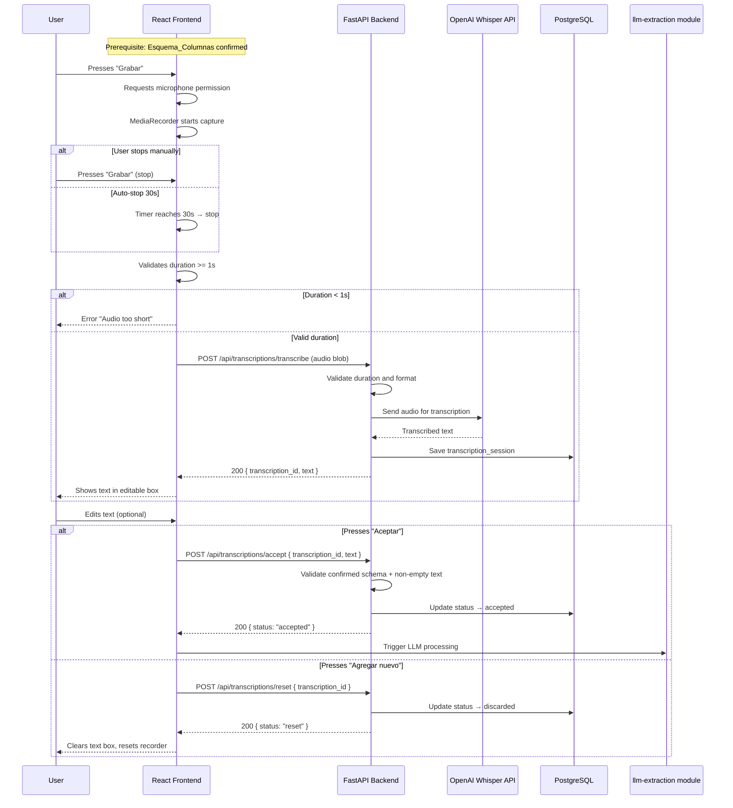

# Design Document — audio-transcription-controls

## Overview

This module handles recording the user's audio from the browser microphone, sending the audio to the backend for transcription via the OpenAI Whisper API, and the flow controls (Accept / Add new) that connect this module to the next one (`llm-extraction-excel-output`).

### Main flow

1. The user presses "Grabar" in the React frontend.
2. The browser requests microphone permission (if not already granted) and starts capturing audio with the MediaRecorder API.
3. The user stops the recording (or it auto-stops at 30 seconds).
4. The frontend sends the audio blob to the backend as `multipart/form-data`.
5. The backend validates the duration (minimum 1s, maximum 30s) and sends the audio to the OpenAI Whisper API.
6. Whisper returns the transcribed text; the backend persists it in PostgreSQL and returns it to the frontend.
7. The user can edit the transcribed text in an editable text box.
8. "Aceptar" sends the text to the `llm-extraction-excel-output` module.
9. "Agregar nuevo" clears the text and resets the recorder for a new iteration.

### Key design decisions

- **MediaRecorder API** in the frontend for audio capture (natively supported in modern browsers, no external dependencies).
- **Audio format**: `audio/webm;codecs=opus` as the preferred format (efficient, supported by Whisper). Fallback to `audio/ogg` if webm is not available.
- **Audio is NOT persisted on disk or in the database**: it is processed in memory and discarded after transcription.
- **The transcribed text IS persisted** in PostgreSQL as part of the transcription session, for traceability and to enable sending it to the downstream module.
- **Duration validation**: performed both in the frontend (immediate UX) and in the backend (security).
- **OpenAI Whisper API** (`whisper-1`) for transcription. A single model, with no language configuration (auto-detect).
- The session pattern from the `excel-template-loader` module is reused (UUID, statuses, timestamps).

## Architecture


### Data flow



## Components and Interfaces

### Backend Components

#### 1. `AudioValidator` (service)

Validates the received audio before sending it to Whisper.

```python
class AudioValidator:
    MIN_DURATION_SECONDS = 1.0
    MAX_DURATION_SECONDS = 30.0
    ALLOWED_MIME_TYPES = {"audio/webm", "audio/ogg", "audio/mp4", "audio/mpeg", "audio/wav"}

    def validate(self, file: UploadFile, duration: float) -> ValidationResult:
        """Validates the audio's MIME type and duration."""
        ...
```

#### 2. `WhisperTranscriptionService` (service)

Orchestrates the call to the OpenAI Whisper API.

```python
class WhisperTranscriptionService:
    MODEL = "whisper-1"

    async def transcribe(self, audio_file: bytes, mime_type: str) -> str:
        """Sends the audio to the Whisper API and returns the transcribed text."""
        ...
```

#### 3. `AcceptanceValidator` (service)

Validates the preconditions for accepting a transcribed text.

```python
class AcceptanceValidator:
    async def validate(self, transcription_id: UUID, text: str) -> ValidationResult:
        """Verifies that non-empty text and a confirmed Esquema_Columnas exist."""
        ...
```

#### 4. `TranscriptionRepository` (repository)

Persistence of transcription sessions in PostgreSQL.

```python
class TranscriptionRepository:
    async def create_session(self, text: str, duration_seconds: float) -> UUID:
        """Creates a transcription session and returns the ID."""
        ...

    async def accept_session(self, transcription_id: UUID, final_text: str) -> None:
        """Marks the session as accepted with the final (possibly edited) text."""
        ...

    async def discard_session(self, transcription_id: UUID) -> None:
        """Marks the session as discarded."""
        ...

    async def get_session(self, transcription_id: UUID) -> Optional[TranscriptionSession]:
        """Retrieves a session by ID."""
        ...
```

### API Endpoints

| Method | Endpoint | Request | Response |
|--------|----------|---------|----------|
| POST | `/api/transcriptions/transcribe` | `multipart/form-data` (audio file + duration) | `{ transcription_id, text }` |
| POST | `/api/transcriptions/accept` | `{ transcription_id, text }` | `{ status: "accepted" }` |
| POST | `/api/transcriptions/reset` | `{ transcription_id }` | `{ status: "reset" }` |
| GET | `/api/transcriptions/{id}` | — | `{ transcription_id, text, status, ... }` |

### Frontend Components

#### 1. `AudioRecorder`

Component that handles audio capture with the MediaRecorder API.

- "Grabar" button with states: idle, recording, processing
- Visual indicator of active recording (red pulse animation)
- Visible timer showing the current duration
- Auto-stop at 30 seconds
- Client-side validation of the minimum duration (1s)
- Microphone permission handling (request, denial, hardware error)

```typescript
interface AudioRecorderState {
  status: 'idle' | 'recording' | 'processing' | 'error';
  duration: number;  // seconds elapsed
  error: string | null;
}
```

#### 2. `TranscriptionDisplay`

Editable text box that displays the transcription result.

- Editable textarea with the transcribed text
- Progress indicator during transcription (spinner)
- Empty state by default
- The text edited by the user is what is sent on "Aceptar"

```typescript
interface TranscriptionDisplayProps {
  text: string;
  isLoading: boolean;
  isDisabled: boolean;
  onChange: (text: string) => void;
}
```

#### 3. `ControlButtons`

"Aceptar" and "Agregar nuevo" buttons with enable/disable logic.

- "Aceptar": enabled only if there is non-empty transcribed text and a confirmed schema
- "Agregar nuevo": always enabled except during LLM processing
- Both disabled during LLM processing
- Contextual error messages if preconditions are missing

```typescript
interface ControlButtonsProps {
  transcribedText: string;
  hasConfirmedSchema: boolean;
  isLLMProcessing: boolean;
  onAccept: () => void;
  onReset: () => void;
}
```

## Data Models

### PostgreSQL Schema

```sql
CREATE TABLE transcription_sessions (
    id UUID PRIMARY KEY DEFAULT gen_random_uuid(),
    template_session_id UUID NOT NULL REFERENCES template_sessions(id),
    status VARCHAR(20) NOT NULL DEFAULT 'pending',  -- pending, accepted, discarded
    original_text TEXT NOT NULL,
    final_text TEXT,
    duration_seconds NUMERIC(5, 2) NOT NULL,
    created_at TIMESTAMP WITH TIME ZONE DEFAULT NOW(),
    accepted_at TIMESTAMP WITH TIME ZONE,
    discarded_at TIMESTAMP WITH TIME ZONE,

    CONSTRAINT chk_status CHECK (status IN ('pending', 'accepted', 'discarded')),
    CONSTRAINT chk_duration CHECK (duration_seconds BETWEEN 1.0 AND 30.0)
);

CREATE INDEX idx_transcription_sessions_status ON transcription_sessions(status);
CREATE INDEX idx_transcription_sessions_template ON transcription_sessions(template_session_id);
```

### Pydantic Models (Backend)

```python
from pydantic import BaseModel, Field
from typing import Optional
from uuid import UUID
from datetime import datetime


class TranscribeResponse(BaseModel):
    transcription_id: UUID
    text: str


class AcceptRequest(BaseModel):
    transcription_id: UUID
    text: str = Field(min_length=1)


class AcceptResponse(BaseModel):
    status: str  # "accepted"


class ResetRequest(BaseModel):
    transcription_id: UUID


class ResetResponse(BaseModel):
    status: str  # "reset"


class TranscriptionSession(BaseModel):
    id: UUID
    template_session_id: UUID
    status: str
    original_text: str
    final_text: Optional[str]
    duration_seconds: float
    created_at: datetime
    accepted_at: Optional[datetime]
    discarded_at: Optional[datetime]


class ErrorResponse(BaseModel):
    detail: str
    error_code: str
```

### TypeScript Types (Frontend)

```typescript
interface TranscribeResponse {
  transcriptionId: string;
  text: string;
}

interface AcceptRequest {
  transcriptionId: string;
  text: string;
}

interface AcceptResponse {
  status: 'accepted';
}

interface ResetRequest {
  transcriptionId: string;
}

interface ResetResponse {
  status: 'reset';
}

interface TranscriptionSession {
  id: string;
  templateSessionId: string;
  status: 'pending' | 'accepted' | 'discarded';
  originalText: string;
  finalText: string | null;
  durationSeconds: number;
  createdAt: string;
  acceptedAt: string | null;
  discardedAt: string | null;
}
```

## Correctness Properties

*A property is a characteristic or behavior that should hold true across all valid executions of a system — essentially, a formal statement about what the system should do. Properties serve as the bridge between human-readable specifications and machine-verifiable correctness guarantees.*

### Property 1: Audio below minimum duration is always rejected

*For any* audio input with a duration strictly less than 1.0 seconds, the AudioValidator shall reject the input and return a validation error, regardless of audio content or MIME type.

**Validates: Requirements 2.4**

### Property 2: Acceptance requires non-empty text and confirmed schema

*For any* non-empty, non-whitespace-only text string combined with an existing confirmed Esquema_Columnas, the acceptance validation shall succeed and the transcription session status shall transition to "accepted".

**Validates: Requirements 3.3**

### Property 3: Empty or whitespace-only text is always rejected on acceptance

*For any* string that is empty or composed entirely of whitespace characters, attempting to accept it shall fail validation and the transcription session shall remain unchanged.

**Validates: Requirements 3.4**

### Property 4: Reset preserves schema while clearing transcription state

*For any* transcription session in any state (pending, with text, after editing), executing a reset shall result in the session being marked as "discarded", the recorder returning to idle state, and the associated template_session_id (Esquema_Columnas) remaining valid and unchanged.

**Validates: Requirements 3.6**

### Property 5: Any error resets recorder to initial state

*For any* error occurring during recording (hardware failure) or transcription (API error, timeout, invalid response), the system shall transition the recorder to its initial idle state with no residual audio data or partial text.

**Validates: Requirements 1.7, 2.6, 3.8**

## Error Handling

### Error categories

| Layer | Error | HTTP code | Response |
|------|-------|-------------|-----------|
| Audio validation | Duration < 1s | 422 | `{ detail: "...", error_code: "AUDIO_TOO_SHORT" }` |
| Audio validation | Duration > 30s | 422 | `{ detail: "...", error_code: "AUDIO_TOO_LONG" }` |
| Audio validation | Unsupported MIME type | 422 | `{ detail: "...", error_code: "UNSUPPORTED_AUDIO_FORMAT" }` |
| Audio validation | Empty file | 422 | `{ detail: "...", error_code: "EMPTY_AUDIO_FILE" }` |
| Acceptance | Empty text | 422 | `{ detail: "...", error_code: "EMPTY_TRANSCRIPTION" }` |
| Acceptance | No confirmed schema | 409 | `{ detail: "...", error_code: "NO_CONFIRMED_SCHEMA" }` |
| Acceptance | Session not found | 404 | `{ detail: "...", error_code: "SESSION_NOT_FOUND" }` |
| Whisper API | Network/timeout error | 502 | `{ detail: "...", error_code: "WHISPER_UNAVAILABLE" }` |
| Whisper API | Empty response | 502 | `{ detail: "...", error_code: "WHISPER_EMPTY_RESPONSE" }` |
| Whisper API | Unrecognizable audio | 422 | `{ detail: "...", error_code: "WHISPER_NO_SPEECH" }` |
| Frontend | Microphone permission denied | — | Inline error in the component |
| Frontend | Microphone hardware error | — | Inline error in the component |
| DB | Connection error | 500 | `{ detail: "...", error_code: "DATABASE_ERROR" }` |

### Retry strategy

- **Whisper API**: At most 2 automatic retries with exponential backoff (1s, 3s) for transient errors (timeout, 5xx).
- **PostgreSQL**: No automatic retries; reported to the user immediately.
- **Validation**: No retries — validation errors require correction by the user.
- **Microphone permissions**: No automatic retries — the user must grant them manually.

### Frontend handling

- 422 errors: Shown inline below the relevant component (recorder or text box).
- 5xx errors (Whisper/DB): Error toast with a "Retry recording" option.
- Permission error: Persistent message with instructions to enable the microphone in the browser.
- Hardware error: Error message suggesting that the user check the audio device.
- Frontend timeout: 30s for the transcription call, 60s for the acceptance/LLM call.
- During errors: The recorder automatically resets to the idle state.

## Testing Strategy

### Unit Tests (pytest)

Specific cases and edge cases:

- The "Grabar" button renders correctly on the main screen.
- Microphone permission is requested when "Grabar" is pressed for the first time.
- Visual indicator of active recording during capture.
- Start/stop toggle of the recorder when the button is pressed.
- Auto-stop at exactly 30 seconds of recording.
- Transcribed text is shown in the editable box after a successful transcription.
- Progress spinner during transcription.
- A Whisper API error clears the text and resets the recorder.
- The "Aceptar" button is disabled without transcribed text.
- The "Aceptar" button shows an error without a confirmed schema.
- Buttons are disabled during LLM processing.
- "Agregar nuevo" clears the text and resets the recorder.

### Property-Based Tests (Hypothesis)

The **Hypothesis** library for Python will be used. Each test will run with a minimum of 100 iterations.

| Property | Description | Tag |
|----------|-------------|-----|
| 1 | Audio below minimum duration rejected | `Feature: audio-transcription-controls, Property 1: Audio below minimum duration is always rejected` |
| 2 | Acceptance requires non-empty text and confirmed schema | `Feature: audio-transcription-controls, Property 2: Acceptance requires non-empty text and confirmed schema` |
| 3 | Empty/whitespace text rejected on acceptance | `Feature: audio-transcription-controls, Property 3: Empty or whitespace-only text is always rejected on acceptance` |
| 4 | Reset preserves schema while clearing state | `Feature: audio-transcription-controls, Property 4: Reset preserves schema while clearing transcription state` |
| 5 | Any error resets recorder to initial state | `Feature: audio-transcription-controls, Property 5: Any error resets recorder to initial state` |

### Integration Tests

- Full flow: record → transcribe → accept → verify session in the DB.
- Reset flow: record → transcribe → add new → verify session discarded.
- Real call to the Whisper API with test audio (mocked in CI).
- Verify that the `/api/templates/active` endpoint returns a confirmed schema before accepting.
- Verify the foreign key constraint with `template_sessions`.
- Timeout handling with the Whisper API (slow-network mock).

### Frontend Tests (Vitest + React Testing Library)

- Component rendering (AudioRecorder, TranscriptionDisplay, ControlButtons).
- Interactions: clicking Grabar, stop, Aceptar, Agregar nuevo.
- Error and loading states.
- Microphone permissions (mock of navigator.mediaDevices).
- Recording timer and auto-stop at 30s.
- Editing the transcribed text.

