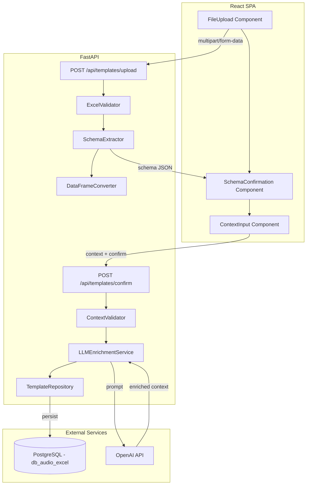
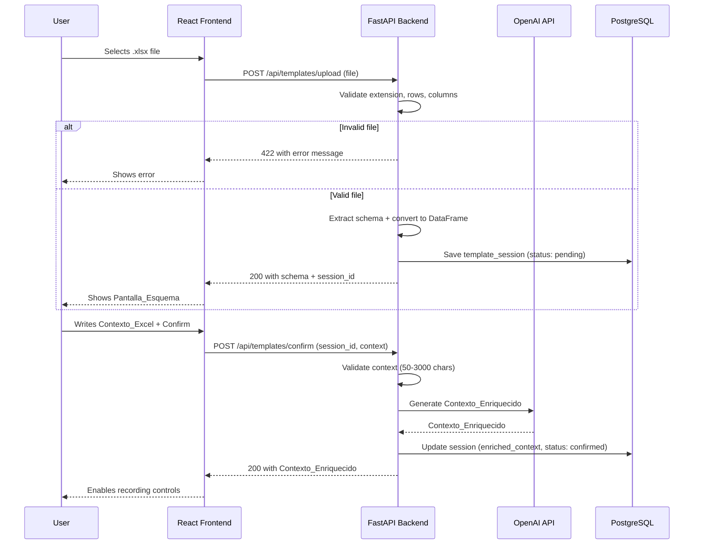

# Design Document — excel-template-loader

## Overview

This module handles the loading, validation, and analysis of Excel files (.xlsx) that act as data templates. The main flow is:

1. The user uploads an `.xlsx` file from the frontend (React).
2. The backend (FastAPI) receives the file and validates it structurally (extension, maximum 8 columns, rows 1-3 complete).
3. If it is valid, it extracts the schema (names, types, examples) and converts the content to a pandas DataFrame.
4. The frontend shows the schema confirmation screen.
5. The user writes a descriptive context (50-3000 characters).
6. On confirmation, the backend sends the context + schema to the OpenAI API to generate the Contexto_Enriquecido.
7. The Contexto_Enriquecido is persisted in PostgreSQL and becomes available to the other modules.

### Key design decisions

- **openpyxl** for reading the .xlsx (the standard library in the Python ecosystem for Excel).
- **pandas** as the internal processing format (DataFrame).
- The .xlsx file is not stored on disk; it is processed in memory and discarded after conversion.
- The schema and enriched context are persisted in PostgreSQL so that the `audio-transcription-controls` and `llm-extraction-excel-output` modules can consume them.
- Validation is fail-fast: the file is rejected at the first structural error found.

## Architecture



### Data flow



## Components and Interfaces

### Backend Components

#### 1. `ExcelValidator` (service)

Responsible for all structural validations of the file.

```python
class ExcelValidator:
    MAX_COLUMNS = 8
    ALLOWED_EXTENSIONS = {".xlsx"}

    def validate(self, file: UploadFile) -> ValidationResult:
        """Validates the file's extension, structure, and content."""
        ...
```

#### 2. `SchemaExtractor` (service)

Extracts the Esquema_Columnas from the first 3 rows.

```python
class SchemaExtractor:
    def extract(self, workbook: Workbook) -> ColumnSchema:
        """Reads rows 1-3 and builds the schema."""
        ...
```

#### 3. `DataFrameConverter` (service)

Converts the Excel content to a pandas DataFrame.

```python
class DataFrameConverter:
    def convert(self, workbook: Workbook, schema: ColumnSchema) -> pd.DataFrame:
        """Converts the full Excel file to a DataFrame using the extracted schema."""
        ...
```

#### 4. `ContextValidator` (service)

Validates the user's Contexto_Excel.

```python
class ContextValidator:
    MIN_LENGTH = 50
    MAX_LENGTH = 3000

    def validate(self, context: str) -> ValidationResult:
        """Validates the context length."""
        ...
```

#### 5. `LLMEnrichmentService` (service)

Orchestrates the call to the model to generate the Contexto_Enriquecido.

```python
class LLMEnrichmentService:
    def enrich(self, context: str, schema: ColumnSchema) -> str:
        """Sends context + schema to the model and returns the Contexto_Enriquecido."""
        ...
```

#### 6. `TemplateRepository` (repository)

Persistence in PostgreSQL.

```python
class TemplateRepository:
    async def create_session(self, schema: ColumnSchema, dataframe_json: str) -> str:
        """Creates a template session and returns the session_id."""
        ...

    async def confirm_session(self, session_id: str, enriched_context: str) -> None:
        """Updates the session with the enriched context and sets status to confirmed."""
        ...

    async def get_active_session(self) -> Optional[TemplateSession]:
        """Returns the active confirmed session."""
        ...
```

### API Endpoints

| Method | Endpoint | Request | Response |
|--------|----------|---------|----------|
| POST | `/api/templates/upload` | `multipart/form-data` (file) | `{ session_id, schema }` |
| POST | `/api/templates/confirm` | `{ session_id, context }` | `{ enriched_context }` |
| GET | `/api/templates/active` | — | `{ session_id, schema, enriched_context }` |
| DELETE | `/api/templates/{session_id}` | — | `204 No Content` |

### Frontend Components

#### 1. `FileUpload`

- File input with an `.xlsx` filter
- Drag-and-drop zone
- Status indicator (idle, uploading, error)
- Displays backend validation error messages

#### 2. `SchemaConfirmation`

- Table with columns: #, Name, Data Type, Example
- "Confirmar" button
- "Cambiar archivo" button

#### 3. `ContextInput`

- Multiline textarea with a character counter (50-3000)
- Real-time validation of the character range
- Progress indicator during Contexto_Enriquecido generation
- "Confirmar y Continuar" button

## Data Models

### PostgreSQL Schema

```sql
CREATE TABLE template_sessions (
    id UUID PRIMARY KEY DEFAULT gen_random_uuid(),
    status VARCHAR(20) NOT NULL DEFAULT 'pending',  -- pending, confirmed, replaced
    schema_json JSONB NOT NULL,
    dataframe_json JSONB NOT NULL,
    user_context TEXT,
    enriched_context TEXT,
    file_name VARCHAR(255) NOT NULL,
    column_count INTEGER NOT NULL,
    created_at TIMESTAMP WITH TIME ZONE DEFAULT NOW(),
    confirmed_at TIMESTAMP WITH TIME ZONE,
    replaced_at TIMESTAMP WITH TIME ZONE,

    CONSTRAINT chk_status CHECK (status IN ('pending', 'confirmed', 'replaced')),
    CONSTRAINT chk_columns CHECK (column_count BETWEEN 1 AND 8)
);

CREATE INDEX idx_template_sessions_status ON template_sessions(status);
```

### Pydantic Models (Backend)

```python
from pydantic import BaseModel, Field
from typing import Optional
from uuid import UUID
from datetime import datetime


class ColumnDef(BaseModel):
    index: int = Field(ge=1, le=8)
    name: str
    data_type: str
    example_value: str


class ColumnSchema(BaseModel):
    columns: list[ColumnDef] = Field(min_length=1, max_length=8)


class UploadResponse(BaseModel):
    session_id: UUID
    schema: ColumnSchema
    file_name: str


class ConfirmRequest(BaseModel):
    session_id: UUID
    context: str = Field(min_length=50, max_length=3000)


class ConfirmResponse(BaseModel):
    enriched_context: str


class ActiveSessionResponse(BaseModel):
    session_id: UUID
    schema: ColumnSchema
    enriched_context: str
    file_name: str
    confirmed_at: datetime


class ErrorResponse(BaseModel):
    detail: str
    error_code: str
```

### TypeScript Types (Frontend)

```typescript
interface ColumnDef {
  index: number;
  name: string;
  dataType: string;
  exampleValue: string;
}

interface ColumnSchema {
  columns: ColumnDef[];
}

interface UploadResponse {
  sessionId: string;
  schema: ColumnSchema;
  fileName: string;
}

interface ConfirmRequest {
  sessionId: string;
  context: string;
}

interface ConfirmResponse {
  enrichedContext: string;
}
```


## Correctness Properties

*A property is a characteristic or behavior that should hold true across all valid executions of a system — essentially, a formal statement about what the system should do. Properties serve as the bridge between human-readable specifications and machine-verifiable correctness guarantees.*

### Property 1: Schema extraction round-trip

*For any* valid Excel file with 1-8 columns where rows 1, 2, and 3 contain non-empty values, extracting the schema and then comparing it against the original header data should produce an equivalent structure (same column names, types, and examples in the same order).

**Validates: Requirements 1.2**

### Property 2: Files exceeding maximum columns are rejected

*For any* Excel file with more than 8 columns (regardless of content), the validator shall reject the file and return an error indicating the column limit was exceeded.

**Validates: Requirements 1.3**

### Property 3: Files with incomplete header rows are rejected

*For any* Excel file where at least one named column has an empty cell in row 2 (Tipo_Dato) or row 3 (Ejemplo_Valor), or where row 1 has no valid column names at all, the validator shall reject the file and identify the affected columns in the error message.

**Validates: Requirements 1.4, 1.5, 1.6**

### Property 4: Non-xlsx files are rejected

*For any* filename whose extension is not `.xlsx`, the validator shall reject the file before attempting to read its contents.

**Validates: Requirements 1.7**

### Property 5: Replacing a file marks the previous session as replaced

*For any* sequence of two valid file uploads, after the second upload completes successfully, the first session shall have status `replaced` and the second session shall be the only one with status `pending` or `confirmed`.

**Validates: Requirements 1.10**

### Property 6: Schema table renders all column information

*For any* valid ColumnSchema with 1-8 columns, rendering the schema table shall produce output that contains every column's index, name, data_type, and example_value.

**Validates: Requirements 2.2**

### Property 7: Context length outside valid range is rejected

*For any* context string whose character count is less than 50 or greater than 3000, the context validator shall reject it and return an appropriate error message.

**Validates: Requirements 3.2, 3.4**

## Error Handling

### Error categories

| Layer | Error | HTTP code | Response |
|------|-------|-------------|-----------|
| File validation | Invalid extension | 422 | `{ detail: "...", error_code: "INVALID_EXTENSION" }` |
| File validation | More than 8 columns | 422 | `{ detail: "...", error_code: "TOO_MANY_COLUMNS" }` |
| File validation | Row 1 without names | 422 | `{ detail: "...", error_code: "EMPTY_HEADER_ROW" }` |
| File validation | Row 2 incomplete | 422 | `{ detail: "...", error_code: "MISSING_DATA_TYPES" }` |
| File validation | Row 3 incomplete | 422 | `{ detail: "...", error_code: "MISSING_EXAMPLES" }` |
| File validation | Corrupt/unreadable file | 422 | `{ detail: "...", error_code: "UNREADABLE_FILE" }` |
| Context validation | Too short (<50) | 422 | `{ detail: "...", error_code: "CONTEXT_TOO_SHORT" }` |
| Context validation | Too long (>3000) | 422 | `{ detail: "...", error_code: "CONTEXT_TOO_LONG" }` |
| LLM | Network/timeout error | 502 | `{ detail: "...", error_code: "LLM_UNAVAILABLE" }` |
| LLM | Empty or invalid response | 502 | `{ detail: "...", error_code: "LLM_INVALID_RESPONSE" }` |
| DB | Session not found | 404 | `{ detail: "...", error_code: "SESSION_NOT_FOUND" }` |
| DB | Connection error | 500 | `{ detail: "...", error_code: "DATABASE_ERROR" }` |

### Retry strategy

- **OpenAI API**: At most 2 automatic retries with exponential backoff (1s, 3s) for transient errors (timeout, 5xx).
- **PostgreSQL**: No automatic retries; reported to the user immediately.
- **Validation**: No retries — validation errors require correction by the user.

### Frontend handling

- 422 errors: Shown inline next to the component that caused the error (upload zone, textarea).
- 5xx errors: Shown as an error toast/banner with a "Retry" option.
- Loading state: Skeleton/spinner during upload and the call to the model.
- Frontend timeout: 30s for upload, 60s for enrichment with the model.

## Testing Strategy

### Unit Tests (pytest)

Specific cases and edge cases:

- A file with exactly 8 columns (the valid limit) is accepted correctly.
- A file with columns whose names contain special characters (accents, ñ, spaces).
- Context with exactly 50 characters is accepted.
- Context with exactly 3000 characters is accepted.
- The model's response is stored correctly in the session.
- The active session is consumable by other modules via GET /api/templates/active.

### Property-Based Tests (Hypothesis)

The **Hypothesis** library for Python will be used. Each test will run with a minimum of 100 iterations.

| Property | Description | Tag |
|----------|-------------|-----|
| 1 | Schema extraction round-trip | `Feature: excel-template-loader, Property 1: Schema extraction round-trip` |
| 2 | Files exceeding max columns rejected | `Feature: excel-template-loader, Property 2: Files exceeding maximum columns are rejected` |
| 3 | Files with incomplete headers rejected | `Feature: excel-template-loader, Property 3: Files with incomplete header rows are rejected` |
| 4 | Non-xlsx files rejected | `Feature: excel-template-loader, Property 4: Non-xlsx files are rejected` |
| 5 | Replacing file marks previous replaced | `Feature: excel-template-loader, Property 5: Replacing a file marks the previous session as replaced` |
| 6 | Schema table renders all info | `Feature: excel-template-loader, Property 6: Schema table renders all column information` |
| 7 | Context length validation | `Feature: excel-template-loader, Property 7: Context length outside valid range is rejected` |

### Integration Tests

- Upload → schema confirmation → context → enrichment: full happy-path flow.
- Real call to the OpenAI API (mocked in CI, not mocked in local manual testing).
- Persistence in PostgreSQL: create session, confirm, retrieve active.
- File replacement: upload two files, verify statuses in the DB.

### Frontend Tests (Vitest + React Testing Library)

- Component rendering (FileUpload, SchemaConfirmation, ContextInput).
- Interactions: file selection, clicking confirm, clicking change.
- Error and loading states.
- Client-side validation of the character counter.
