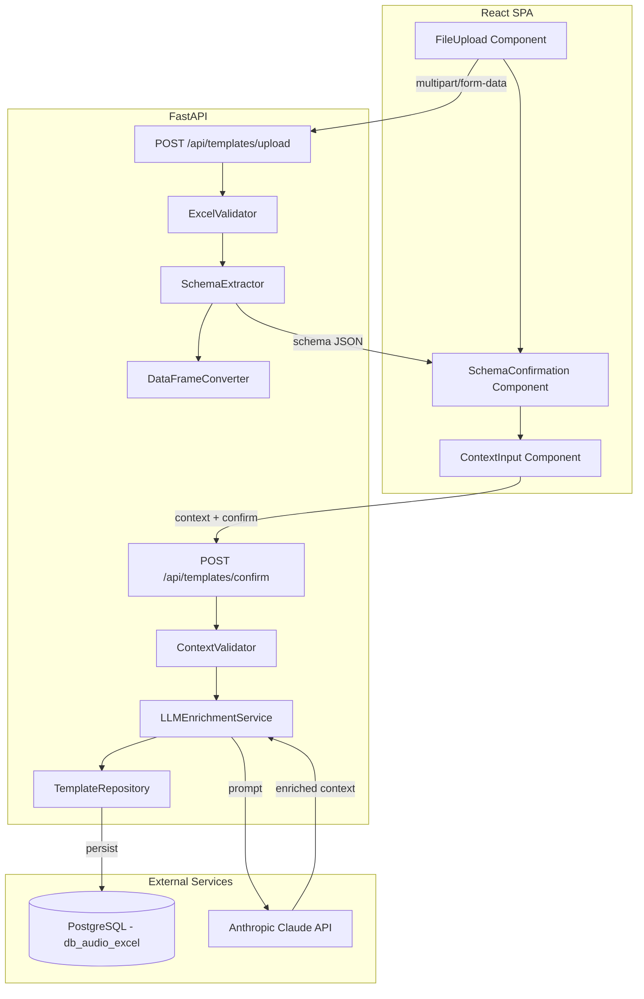
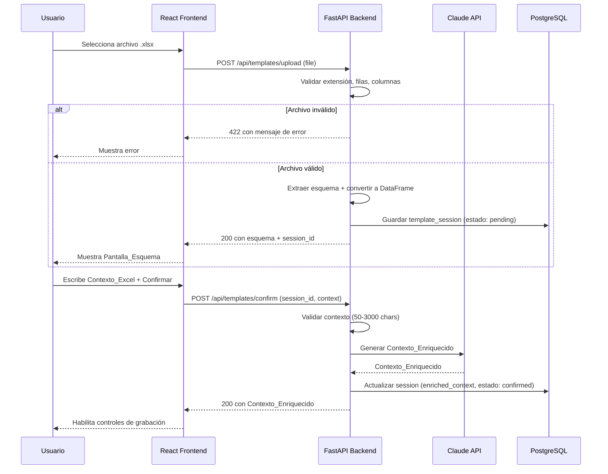

# Design Document — excel-template-loader

## Overview

Este módulo gestiona la carga, validación y análisis de archivos Excel (.xlsx) que actúan como plantillas de datos. El flujo principal es:

1. El usuario sube un archivo `.xlsx` desde el frontend (React).
2. El backend (FastAPI) recibe el archivo, lo valida estructuralmente (extensión, máximo 8 columnas, filas 1-3 completas).
3. Si es válido, extrae el esquema (nombres, tipos, ejemplos) y convierte el contenido a un DataFrame de pandas.
4. El frontend muestra la pantalla de confirmación del esquema.
5. El usuario escribe un contexto descriptivo (50-3000 caracteres).
6. Al confirmar, el backend envía el contexto + esquema a la API de Anthropic Claude para generar el Contexto_Enriquecido.
7. El Contexto_Enriquecido se persiste en PostgreSQL y queda disponible para los demás módulos.

### Decisiones clave de diseño

- **openpyxl** para lectura del .xlsx (librería estándar del ecosistema Python para Excel).
- **pandas** como formato interno de procesamiento (DataFrame).
- El archivo .xlsx no se almacena en disco; se procesa en memoria y se descarta tras la conversión.
- El esquema y contexto enriquecido se persisten en PostgreSQL para que los módulos `audio-transcription-controls` y `llm-extraction-excel-output` los consuman.
- La validación es fail-fast: se rechaza al primer error estructural encontrado.

## Architecture



### Flujo de datos



## Components and Interfaces

### Backend Components

#### 1. `ExcelValidator` (service)

Responsable de todas las validaciones estructurales del archivo.

```python
class ExcelValidator:
    MAX_COLUMNS = 8
    ALLOWED_EXTENSIONS = {".xlsx"}

    def validate(self, file: UploadFile) -> ValidationResult:
        """Valida extensión, estructura y contenido del archivo."""
        ...
```

#### 2. `SchemaExtractor` (service)

Extrae el Esquema_Columnas de las primeras 3 filas.

```python
class SchemaExtractor:
    def extract(self, workbook: Workbook) -> ColumnSchema:
        """Lee filas 1-3 y construye el esquema."""
        ...
```

#### 3. `DataFrameConverter` (service)

Convierte el contenido del Excel a DataFrame de pandas.

```python
class DataFrameConverter:
    def convert(self, workbook: Workbook, schema: ColumnSchema) -> pd.DataFrame:
        """Convierte el Excel completo a DataFrame usando el esquema extraído."""
        ...
```

#### 4. `ContextValidator` (service)

Valida el Contexto_Excel del usuario.

```python
class ContextValidator:
    MIN_LENGTH = 50
    MAX_LENGTH = 3000

    def validate(self, context: str) -> ValidationResult:
        """Valida longitud del contexto."""
        ...
```

#### 5. `LLMEnrichmentService` (service)

Orquesta la llamada a Claude para generar el Contexto_Enriquecido.

```python
class LLMEnrichmentService:
    def enrich(self, context: str, schema: ColumnSchema) -> str:
        """Envía contexto + esquema a Claude y retorna el Contexto_Enriquecido."""
        ...
```

#### 6. `TemplateRepository` (repository)

Persistencia en PostgreSQL.

```python
class TemplateRepository:
    async def create_session(self, schema: ColumnSchema, dataframe_json: str) -> str:
        """Crea una sesión de template y retorna el session_id."""
        ...

    async def confirm_session(self, session_id: str, enriched_context: str) -> None:
        """Actualiza la sesión con el contexto enriquecido y estado confirmed."""
        ...

    async def get_active_session(self) -> Optional[TemplateSession]:
        """Retorna la sesión activa confirmada."""
        ...
```

### API Endpoints

| Método | Endpoint | Request | Response |
|--------|----------|---------|----------|
| POST | `/api/templates/upload` | `multipart/form-data` (file) | `{ session_id, schema }` |
| POST | `/api/templates/confirm` | `{ session_id, context }` | `{ enriched_context }` |
| GET | `/api/templates/active` | — | `{ session_id, schema, enriched_context }` |
| DELETE | `/api/templates/{session_id}` | — | `204 No Content` |

### Frontend Components

#### 1. `FileUpload`

- Input file con filtro `.xlsx`
- Drag & drop zone
- Indicador de estado (idle, uploading, error)
- Muestra mensajes de error de validación del backend

#### 2. `SchemaConfirmation`

- Tabla con columnas: #, Nombre, Tipo de Dato, Ejemplo
- Botón "Confirmar"
- Botón "Cambiar archivo"

#### 3. `ContextInput`

- Textarea multilínea con contador de caracteres (50-3000)
- Validación en tiempo real del rango de caracteres
- Indicador de progreso durante la generación del Contexto_Enriquecido
- Botón "Confirmar y Continuar"

## Data Models

### PostgreSQL Schema

```sql
CREATE TABLE template_sessions (
    id UUID PRIMARY KEY DEFAULT gen_random_uuid(),
    status VARCHAR(20) NOT NULL DEFAULT 'pending',  -- pending, confirmed, replaced
    schema_json JSONB NOT NULL,
    dataframe_json JSONB NOT NULL,
    user_context TEXT,
    enriched_context TEXT,
    file_name VARCHAR(255) NOT NULL,
    column_count INTEGER NOT NULL,
    created_at TIMESTAMP WITH TIME ZONE DEFAULT NOW(),
    confirmed_at TIMESTAMP WITH TIME ZONE,
    replaced_at TIMESTAMP WITH TIME ZONE,

    CONSTRAINT chk_status CHECK (status IN ('pending', 'confirmed', 'replaced')),
    CONSTRAINT chk_columns CHECK (column_count BETWEEN 1 AND 8)
);

CREATE INDEX idx_template_sessions_status ON template_sessions(status);
```

### Pydantic Models (Backend)

```python
from pydantic import BaseModel, Field
from typing import Optional
from uuid import UUID
from datetime import datetime


class ColumnDef(BaseModel):
    index: int = Field(ge=1, le=8)
    name: str
    data_type: str
    example_value: str


class ColumnSchema(BaseModel):
    columns: list[ColumnDef] = Field(min_length=1, max_length=8)


class UploadResponse(BaseModel):
    session_id: UUID
    schema: ColumnSchema
    file_name: str


class ConfirmRequest(BaseModel):
    session_id: UUID
    context: str = Field(min_length=50, max_length=3000)


class ConfirmResponse(BaseModel):
    enriched_context: str


class ActiveSessionResponse(BaseModel):
    session_id: UUID
    schema: ColumnSchema
    enriched_context: str
    file_name: str
    confirmed_at: datetime


class ErrorResponse(BaseModel):
    detail: str
    error_code: str
```

### TypeScript Types (Frontend)

```typescript
interface ColumnDef {
  index: number;
  name: string;
  dataType: string;
  exampleValue: string;
}

interface ColumnSchema {
  columns: ColumnDef[];
}

interface UploadResponse {
  sessionId: string;
  schema: ColumnSchema;
  fileName: string;
}

interface ConfirmRequest {
  sessionId: string;
  context: string;
}

interface ConfirmResponse {
  enrichedContext: string;
}
```


## Correctness Properties

*A property is a characteristic or behavior that should hold true across all valid executions of a system — essentially, a formal statement about what the system should do. Properties serve as the bridge between human-readable specifications and machine-verifiable correctness guarantees.*

### Property 1: Schema extraction round-trip

*For any* valid Excel file with 1-8 columns where rows 1, 2, and 3 contain non-empty values, extracting the schema and then comparing it against the original header data should produce an equivalent structure (same column names, types, and examples in the same order).

**Validates: Requirements 1.2**

### Property 2: Files exceeding maximum columns are rejected

*For any* Excel file with more than 8 columns (regardless of content), the validator shall reject the file and return an error indicating the column limit was exceeded.

**Validates: Requirements 1.3**

### Property 3: Files with incomplete header rows are rejected

*For any* Excel file where at least one named column has an empty cell in row 2 (Tipo_Dato) or row 3 (Ejemplo_Valor), or where row 1 has no valid column names at all, the validator shall reject the file and identify the affected columns in the error message.

**Validates: Requirements 1.4, 1.5, 1.6**

### Property 4: Non-xlsx files are rejected

*For any* filename whose extension is not `.xlsx`, the validator shall reject the file before attempting to read its contents.

**Validates: Requirements 1.7**

### Property 5: Replacing a file marks the previous session as replaced

*For any* sequence of two valid file uploads, after the second upload completes successfully, the first session shall have status `replaced` and the second session shall be the only one with status `pending` or `confirmed`.

**Validates: Requirements 1.10**

### Property 6: Schema table renders all column information

*For any* valid ColumnSchema with 1-8 columns, rendering the schema table shall produce output that contains every column's index, name, data_type, and example_value.

**Validates: Requirements 2.2**

### Property 7: Context length outside valid range is rejected

*For any* context string whose character count is less than 50 or greater than 3000, the context validator shall reject it and return an appropriate error message.

**Validates: Requirements 3.2, 3.4**

## Error Handling

### Categorías de errores

| Capa | Error | Código HTTP | Respuesta |
|------|-------|-------------|-----------|
| Validación archivo | Extensión inválida | 422 | `{ detail: "...", error_code: "INVALID_EXTENSION" }` |
| Validación archivo | Más de 8 columnas | 422 | `{ detail: "...", error_code: "TOO_MANY_COLUMNS" }` |
| Validación archivo | Fila 1 sin nombres | 422 | `{ detail: "...", error_code: "EMPTY_HEADER_ROW" }` |
| Validación archivo | Fila 2 incompleta | 422 | `{ detail: "...", error_code: "MISSING_DATA_TYPES" }` |
| Validación archivo | Fila 3 incompleta | 422 | `{ detail: "...", error_code: "MISSING_EXAMPLES" }` |
| Validación archivo | Archivo corrupto/ilegible | 422 | `{ detail: "...", error_code: "UNREADABLE_FILE" }` |
| Validación contexto | Demasiado corto (<50) | 422 | `{ detail: "...", error_code: "CONTEXT_TOO_SHORT" }` |
| Validación contexto | Demasiado largo (>3000) | 422 | `{ detail: "...", error_code: "CONTEXT_TOO_LONG" }` |
| LLM | Error de red/timeout | 502 | `{ detail: "...", error_code: "LLM_UNAVAILABLE" }` |
| LLM | Respuesta vacía o inválida | 502 | `{ detail: "...", error_code: "LLM_INVALID_RESPONSE" }` |
| DB | Sesión no encontrada | 404 | `{ detail: "...", error_code: "SESSION_NOT_FOUND" }` |
| DB | Error de conexión | 500 | `{ detail: "...", error_code: "DATABASE_ERROR" }` |

### Estrategia de reintentos

- **Claude API**: Máximo 2 reintentos automáticos con backoff exponencial (1s, 3s) para errores transitorios (timeout, 5xx).
- **PostgreSQL**: Sin reintentos automáticos; se reporta al usuario inmediatamente.
- **Validación**: Sin reintentos — los errores de validación requieren corrección del usuario.

### Manejo en el Frontend

- Errores 422: Se muestran inline junto al componente que originó el error (upload zone, textarea).
- Errores 5xx: Se muestran como toast/banner de error con opción "Reintentar".
- Estado de loading: Skeleton/spinner durante upload y llamada a Claude.
- Timeout del frontend: 30s para upload, 60s para enriquecimiento con Claude.

## Testing Strategy

### Unit Tests (pytest)

Casos específicos y edge cases:

- Archivo con exactamente 8 columnas (límite válido) se acepta correctamente.
- Archivo con columnas que contienen caracteres especiales en nombres (acentos, ñ, espacios).
- Contexto con exactamente 50 caracteres es aceptado.
- Contexto con exactamente 3000 caracteres es aceptado.
- Respuesta de Claude se almacena correctamente en la sesión.
- Sesión activa es consumible por otros módulos vía GET /api/templates/active.

### Property-Based Tests (Hypothesis)

Se usará la librería **Hypothesis** para Python. Cada test se ejecutará con un mínimo de 100 iteraciones.

| Property | Descripción | Tag |
|----------|-------------|-----|
| 1 | Schema extraction round-trip | `Feature: excel-template-loader, Property 1: Schema extraction round-trip` |
| 2 | Files exceeding max columns rejected | `Feature: excel-template-loader, Property 2: Files exceeding maximum columns are rejected` |
| 3 | Files with incomplete headers rejected | `Feature: excel-template-loader, Property 3: Files with incomplete header rows are rejected` |
| 4 | Non-xlsx files rejected | `Feature: excel-template-loader, Property 4: Non-xlsx files are rejected` |
| 5 | Replacing file marks previous replaced | `Feature: excel-template-loader, Property 5: Replacing a file marks the previous session as replaced` |
| 6 | Schema table renders all info | `Feature: excel-template-loader, Property 6: Schema table renders all column information` |
| 7 | Context length validation | `Feature: excel-template-loader, Property 7: Context length outside valid range is rejected` |

### Integration Tests

- Upload → schema confirmation → context → enrichment: flujo completo happy-path.
- Llamada real a Claude API (con mock en CI, sin mock en prueba manual local).
- Persistencia en PostgreSQL: crear sesión, confirmar, obtener activa.
- Reemplazo de archivo: subir dos archivos, verificar estados en DB.

### Frontend Tests (Vitest + React Testing Library)

- Renderizado de componentes (FileUpload, SchemaConfirmation, ContextInput).
- Interacciones: selección de archivo, click en confirmar, click en cambiar.
- Estados de error y loading.
- Validación client-side del contador de caracteres.
