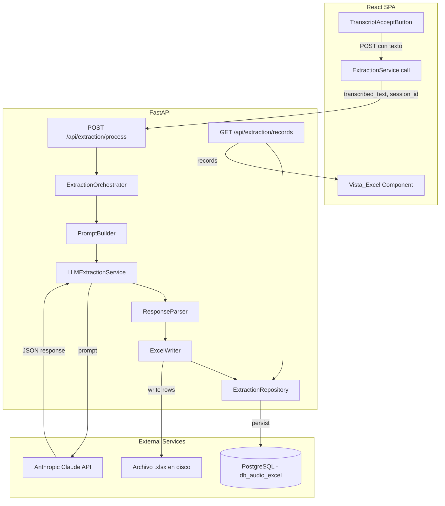
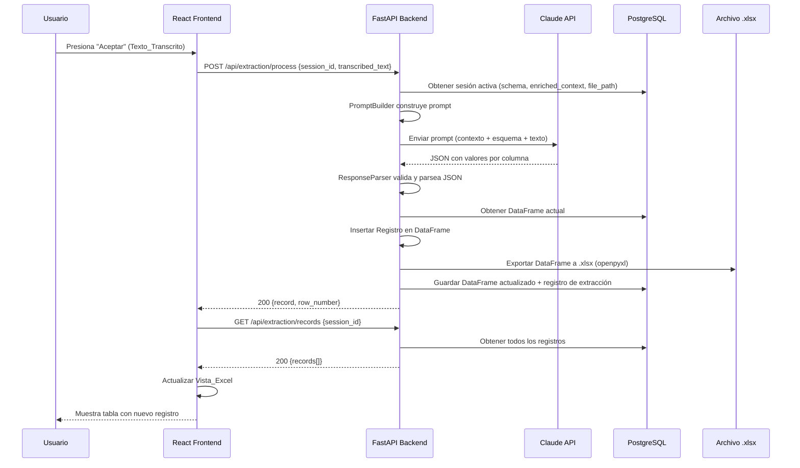

# Design Document — llm-extraction-excel-output

## Overview

Este módulo recibe el Texto_Transcrito del módulo `audio-transcription-controls` y, usando el Esquema_Columnas + Contexto_Enriquecido del módulo `excel-template-loader`, envía un prompt estructurado a la API de Anthropic Claude para extraer los valores correspondientes a cada columna. Los valores extraídos se insertan como un nuevo Registro (fila) en el Archivo_Excel y se guardan en disco. La Vista_Excel muestra los datos resultantes una vez que el procesamiento completa exitosamente.

### Decisiones clave de diseño

- **Anthropic Claude API** como motor de extracción de campos — se usa el SDK oficial `anthropic` para Python.
- **openpyxl** para la escritura del archivo `.xlsx` en disco (coherente con `excel-template-loader`).
- **pandas** como formato interno de procesamiento (DataFrame) — se reutiliza el DataFrame del módulo `excel-template-loader`.
- La respuesta del LLM se parsea como **JSON estructurado** (un valor por columna del Esquema_Columnas).
- El archivo `.xlsx` se **sobreescribe en disco** tras cada inserción exitosa de un Registro.
- La Vista_Excel **NO muestra progreso en tiempo real** — solo se actualiza tras la inserción exitosa.
- Si un campo no se puede identificar en la transcripción, se deja **vacío** (string vacío).
- Si el LLM falla, se **preserva el Texto_Transcrito** para permitir reintento sin volver a grabar.
- Reintentos automáticos (máximo 2) con backoff exponencial para errores transitorios de Claude API (coherente con `excel-template-loader`).

## Architecture



### Flujo de datos



## Components and Interfaces

### Backend Components

#### 1. `PromptBuilder` (service)

Construye el prompt estructurado para Claude combinando Contexto_Enriquecido + Esquema_Columnas + Texto_Transcrito.

```python
class PromptBuilder:
    def build(
        self,
        enriched_context: str,
        schema: ColumnSchema,
        transcribed_text: str,
    ) -> str:
        """
        Construye el prompt para Claude.
        Incluye:
        - Contexto_Enriquecido como system context
        - Esquema con nombre, tipo y ejemplo por columna
        - Texto_Transcrito como input a analizar
        - Instrucciones de formato de respuesta (JSON)
        """
        ...
```

#### 2. `LLMExtractionService` (service)

Orquesta la llamada a Claude para extraer campos del texto transcrito.

```python
class LLMExtractionService:
    MAX_RETRIES = 2
    RETRY_DELAYS = [1, 3]  # segundos

    async def extract(self, prompt: str) -> dict:
        """
        Envía el prompt a Claude API y retorna el JSON parseado.
        Reintenta automáticamente en errores transitorios.
        """
        ...
```

#### 3. `ResponseParser` (service)

Parsea y valida la respuesta JSON de Claude contra el Esquema_Columnas.

```python
class ResponseParser:
    def parse(self, raw_response: str, schema: ColumnSchema) -> dict[str, str]:
        """
        Parsea la respuesta de Claude como JSON.
        Valida que las claves correspondan a las columnas del esquema.
        Asigna string vacío a campos faltantes o nulos.
        Retorna dict {column_name: value}.
        """
        ...
```

#### 4. `ExcelWriter` (service)

Escribe el DataFrame actualizado al archivo .xlsx en disco usando openpyxl.

```python
class ExcelWriter:
    def write(
        self,
        dataframe: pd.DataFrame,
        file_path: str,
        schema: ColumnSchema,
    ) -> None:
        """
        Exporta el DataFrame completo al archivo .xlsx.
        Preserva las filas de cabecera (1-3) y escribe datos desde fila 4.
        Sobreescribe el archivo existente.
        """
        ...
```

#### 5. `ExtractionOrchestrator` (service)

Orquesta el flujo completo: build prompt → call LLM → parse response → insert row → write file.

```python
class ExtractionOrchestrator:
    def __init__(
        self,
        prompt_builder: PromptBuilder,
        llm_service: LLMExtractionService,
        response_parser: ResponseParser,
        excel_writer: ExcelWriter,
        repository: ExtractionRepository,
    ):
        ...

    async def process(
        self,
        session_id: str,
        transcribed_text: str,
    ) -> ExtractionResult:
        """
        Flujo completo:
        1. Obtener sesión activa (schema, enriched_context, file_path)
        2. Construir prompt
        3. Llamar a Claude
        4. Parsear respuesta
        5. Insertar fila en DataFrame
        6. Escribir .xlsx en disco
        7. Persistir en DB
        8. Retornar resultado
        """
        ...
```

#### 6. `ExtractionRepository` (repository)

Persistencia de registros de extracción y DataFrame actualizado en PostgreSQL.

```python
class ExtractionRepository:
    async def save_extraction(
        self,
        session_id: str,
        record: dict,
        row_number: int,
        transcribed_text: str,
    ) -> str:
        """Guarda el registro de extracción y retorna extraction_id."""
        ...

    async def get_records(self, session_id: str) -> list[dict]:
        """Retorna todos los registros extraídos para una sesión."""
        ...

    async def update_dataframe(
        self,
        session_id: str,
        dataframe_json: str,
    ) -> None:
        """Actualiza el DataFrame JSON en la sesión de template."""
        ...

    async def get_session_with_context(self, session_id: str) -> TemplateSession:
        """Obtiene la sesión con schema, enriched_context y file_path."""
        ...
```

### API Endpoints

| Método | Endpoint | Request | Response |
|--------|----------|---------|----------|
| POST | `/api/extraction/process` | `{ session_id, transcribed_text }` | `{ extraction_id, record, row_number }` |
| GET | `/api/extraction/records/{session_id}` | — | `{ records: [...], total_rows }` |

### Frontend Components

#### 1. `ExtractionStatus`

- Indicador de estado: idle, processing, success, error
- Spinner durante procesamiento
- Mensaje de éxito con número de fila insertada
- Mensaje de error con opción de reintentar

#### 2. `VistaExcel`

- Tabla HTML que muestra el contenido del Archivo_Excel (fila 4+)
- Columnas: las del Esquema_Columnas
- Se actualiza SOLO tras inserción exitosa (no muestra progreso)
- Se oculta o queda sin cambios durante el procesamiento
- Muestra registros previamente guardados al cargar la sesión

## Data Models

### PostgreSQL Schema

```sql
CREATE TABLE extraction_records (
    id UUID PRIMARY KEY DEFAULT gen_random_uuid(),
    session_id UUID NOT NULL REFERENCES template_sessions(id),
    row_number INTEGER NOT NULL,
    record_json JSONB NOT NULL,
    transcribed_text TEXT NOT NULL,
    status VARCHAR(20) NOT NULL DEFAULT 'completed',  -- completed, failed
    error_message TEXT,
    created_at TIMESTAMP WITH TIME ZONE DEFAULT NOW(),

    CONSTRAINT chk_extraction_status CHECK (status IN ('completed', 'failed')),
    CONSTRAINT chk_row_number CHECK (row_number >= 4)
);

CREATE INDEX idx_extraction_records_session ON extraction_records(session_id);
CREATE INDEX idx_extraction_records_created ON extraction_records(created_at);
```

Nota: La tabla `template_sessions` (del módulo `excel-template-loader`) se extiende con una columna adicional:

```sql
ALTER TABLE template_sessions ADD COLUMN file_path VARCHAR(500);
```

### Pydantic Models (Backend)

```python
from pydantic import BaseModel, Field
from typing import Optional
from uuid import UUID
from datetime import datetime


class ExtractionRequest(BaseModel):
    session_id: UUID
    transcribed_text: str = Field(min_length=1)


class RecordValue(BaseModel):
    column_name: str
    value: str  # string vacío si no se identificó


class ExtractionResult(BaseModel):
    extraction_id: UUID
    record: list[RecordValue]
    row_number: int = Field(ge=4)


class ExtractionRecord(BaseModel):
    extraction_id: UUID
    row_number: int
    record: list[RecordValue]
    transcribed_text: str
    created_at: datetime


class RecordsResponse(BaseModel):
    records: list[ExtractionRecord]
    total_rows: int


class ErrorResponse(BaseModel):
    detail: str
    error_code: str
```

### TypeScript Types (Frontend)

```typescript
interface RecordValue {
  columnName: string;
  value: string;
}

interface ExtractionRequest {
  sessionId: string;
  transcribedText: string;
}

interface ExtractionResult {
  extractionId: string;
  record: RecordValue[];
  rowNumber: number;
}

interface ExtractionRecord {
  extractionId: string;
  rowNumber: number;
  record: RecordValue[];
  transcribedText: string;
  createdAt: string;
}

interface RecordsResponse {
  records: ExtractionRecord[];
  totalRows: number;
}
```

### Prompt Structure (Claude API)

```
System: Eres un asistente de extracción de datos. Tu tarea es identificar valores
específicos en un texto transcrito de audio y retornarlos en formato JSON.

{Contexto_Enriquecido}

---

El esquema del Excel tiene las siguientes columnas:

| # | Nombre | Tipo de dato | Ejemplo |
|---|--------|--------------|---------|
| 1 | {col1.name} | {col1.data_type} | {col1.example_value} |
| 2 | {col2.name} | {col2.data_type} | {col2.example_value} |
...

---

Texto transcrito del audio:
"{transcribed_text}"

---

Instrucciones:
- Identifica en el texto transcrito el valor correspondiente a CADA columna.
- Si no puedes identificar un valor para alguna columna, usa un string vacío "".
- Respeta el tipo de dato indicado para cada columna.
- Responde ÚNICAMENTE con un JSON válido con esta estructura exacta:
{
  "{col1.name}": "valor extraído",
  "{col2.name}": "valor extraído",
  ...
}
```


## Correctness Properties

*A property is a characteristic or behavior that should hold true across all valid executions of a system — essentially, a formal statement about what the system should do. Properties serve as the bridge between human-readable specifications and machine-verifiable correctness guarantees.*

### Property 1: Prompt completeness

*For any* valid ColumnSchema (1-8 columns with non-empty name, data_type, and example_value) and any non-empty transcribed text string, the prompt built by PromptBuilder shall contain every column's name, data_type, and example_value, as well as the full transcribed text.

**Validates: Requirements 1.1**

### Property 2: Response parsing normalization

*For any* valid ColumnSchema and any JSON response (including responses with missing keys, null values, or extra keys), the ResponseParser shall produce a dict with exactly one entry per column in the schema, where missing or null values are replaced by empty strings, and no extra keys are present.

**Validates: Requirements 1.3, 1.4**

### Property 3: Record insertion invariant

*For any* valid ColumnSchema, any existing DataFrame (with 0 or more rows), and any Record (dict mapping column names to string values), inserting the Record into the DataFrame shall increase the row count by exactly 1, and the values of the new last row shall match the Record in the column order defined by the schema.

**Validates: Requirements 2.1**

### Property 4: Excel write/read round-trip

*For any* valid DataFrame with data rows and a valid ColumnSchema, writing the DataFrame to an .xlsx file using ExcelWriter and then reading back rows 4+ from that file shall produce data equivalent to the original DataFrame content.

**Validates: Requirements 2.2**

## Error Handling

### Categorías de errores

| Capa | Error | Código HTTP | Respuesta |
|------|-------|-------------|-----------|
| Validación input | Texto vacío | 422 | `{ detail: "El texto transcrito está vacío", error_code: "EMPTY_TRANSCRIPTION" }` |
| Validación input | Sesión no encontrada | 404 | `{ detail: "...", error_code: "SESSION_NOT_FOUND" }` |
| Validación input | Sesión no confirmada | 422 | `{ detail: "...", error_code: "SESSION_NOT_CONFIRMED" }` |
| LLM | Error de red/timeout | 502 | `{ detail: "...", error_code: "LLM_UNAVAILABLE" }` |
| LLM | Respuesta no es JSON válido | 502 | `{ detail: "...", error_code: "LLM_INVALID_RESPONSE" }` |
| LLM | Respuesta vacía | 502 | `{ detail: "...", error_code: "LLM_EMPTY_RESPONSE" }` |
| Archivo | Error al escribir en disco | 500 | `{ detail: "...", error_code: "FILE_WRITE_ERROR" }` |
| Archivo | Archivo no encontrado | 500 | `{ detail: "...", error_code: "FILE_NOT_FOUND" }` |
| DB | Error de conexión | 500 | `{ detail: "...", error_code: "DATABASE_ERROR" }` |

### Estrategia de reintentos

- **Claude API**: Máximo 2 reintentos automáticos con backoff exponencial (1s, 3s) para errores transitorios (timeout, 5xx). Coherente con `excel-template-loader`.
- **Escritura en disco**: Sin reintentos automáticos — se reporta al usuario inmediatamente.
- **PostgreSQL**: Sin reintentos automáticos — se reporta al usuario inmediatamente.

### Preservación del Texto_Transcrito

En cualquier escenario de error:
- El backend **no modifica** el Texto_Transcrito almacenado en el frontend.
- El frontend **mantiene** el cuadro de texto con el Texto_Transcrito original.
- El usuario puede presionar "Aceptar" nuevamente para reintentar sin re-grabar.

### Manejo en el Frontend

- Errores 422: Se muestran inline como mensaje bajo el cuadro de texto.
- Errores 5xx: Se muestran como toast/banner de error con opción "Reintentar".
- Estado de loading: Spinner en el botón "Aceptar" y botones deshabilitados durante procesamiento.
- Timeout del frontend: 60s para la llamada de extracción (incluye el tiempo de Claude).

## Testing Strategy

### Unit Tests (pytest)

Casos específicos y edge cases:

- Texto vacío es rechazado con 422.
- Texto compuesto solo de whitespace es rechazado.
- Sesión inexistente retorna 404.
- Sesión no confirmada (status: pending) retorna 422.
- Respuesta de Claude con todos los campos presentes se parsea correctamente.
- Respuesta de Claude con campos faltantes asigna string vacío.
- Respuesta de Claude con campos extra (no en schema) son ignorados.
- Respuesta de Claude que no es JSON válido retorna error 502.
- Error de escritura en disco retorna 500 con mensaje descriptivo.
- Registro insertado tiene row_number correcto (4 para el primer registro, 5 para el segundo, etc.).
- GET /api/extraction/records retorna solo filas de datos, no cabeceras.

### Property-Based Tests (Hypothesis)

Se usará la librería **Hypothesis** para Python. Cada test se ejecutará con un mínimo de 100 iteraciones.

| Property | Descripción | Tag |
|----------|-------------|-----|
| 1 | Prompt completeness | `Feature: llm-extraction-excel-output, Property 1: Prompt completeness` |
| 2 | Response parsing normalization | `Feature: llm-extraction-excel-output, Property 2: Response parsing normalization` |
| 3 | Record insertion invariant | `Feature: llm-extraction-excel-output, Property 3: Record insertion invariant` |
| 4 | Excel write/read round-trip | `Feature: llm-extraction-excel-output, Property 4: Excel write/read round-trip` |

### Integration Tests

- Flujo completo happy-path: process → insert → get records → verificar registro.
- Llamada real a Claude API con texto de prueba (mock en CI, real en prueba manual local).
- Persistencia en PostgreSQL: guardar extracción, obtener records, verificar row_numbers.
- Escritura de archivo .xlsx: verificar contenido con openpyxl tras inserción.
- Registros pre-existentes: cargar archivo con datos (fila 4+), verificar que aparecen en GET /records.

### Frontend Tests (Vitest + React Testing Library)

- Renderizado de VistaExcel con datos mockeados.
- VistaExcel oculta/sin cambios durante procesamiento (estado loading).
- VistaExcel se actualiza tras éxito.
- ExtractionStatus muestra spinner, luego éxito, luego error según estado.
- Botón "Aceptar" deshabilitado durante procesamiento.
- Texto_Transcrito preservado tras error (cuadro de texto no se limpia).
