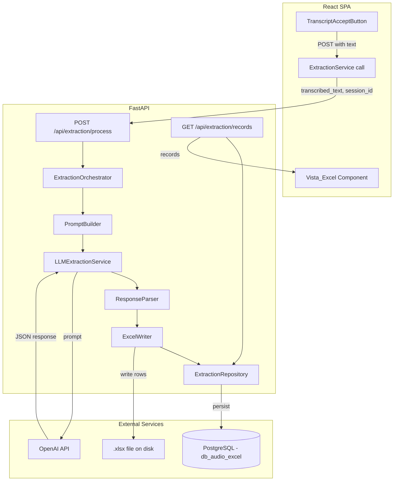
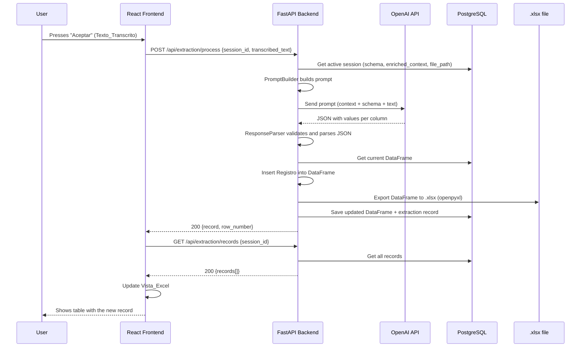

# Design Document — llm-extraction-excel-output

> **⚠️ Partly superseded by [ADR-0013](../../../docs/adr/0013-in-memory-rows-on-demand-excel-export.md).**
> The original design wrote the `.xlsx` to disk and overwrote it after every row
> (needing a `file_path`). That path was replaced: records are kept in the
> database (single source of truth), the session closes on **Finalize or 5 rows**,
> and the final `.xlsx` is **rebuilt in memory from the schema on download** —
> with only a column-name header (no `Tipo_Dato`/`Ejemplo_Valor` rows) and no
> server-side file. Where this document says "saved/overwritten on disk",
> "`file_path`", "DataFrame persisted", or "ExcelWriter", read ADR-0013 instead.

## Overview

This module receives the Texto_Transcrito from the `audio-transcription-controls` module and, using the Esquema_Columnas + Contexto_Enriquecido from the `excel-template-loader` module, sends a structured prompt to the OpenAI API to extract the values corresponding to each column. The extracted values are inserted as a new Registro (row) in the Archivo_Excel and saved to disk. The Vista_Excel shows the resulting data once processing completes successfully.

### Key design decisions

- **OpenAI API** (`gpt-4o-mini`) as the field extraction engine — the official `openai` SDK for Python is used.
- **openpyxl** for writing the `.xlsx` file to disk (consistent with `excel-template-loader`).
- **pandas** as the internal processing format (DataFrame) — the DataFrame from the `excel-template-loader` module is reused.
- The LLM response is parsed as **structured JSON** (one value per column of the Esquema_Columnas).
- The `.xlsx` file is **overwritten on disk** after each successful insertion of a Registro.
- The Vista_Excel does **NOT show real-time progress** — it is only updated after a successful insertion.
- If a field cannot be identified in the transcription, it is left **empty** (empty string).
- If the LLM fails, the **Texto_Transcrito is preserved** to allow retrying without recording again.
- Automatic retries (at most 2) with exponential backoff for transient OpenAI API errors (consistent with `excel-template-loader`).

## Architecture



### Data flow



## Components and Interfaces

### Backend Components

#### 1. `PromptBuilder` (service)

Builds the structured prompt for the model by combining Contexto_Enriquecido + Esquema_Columnas + Texto_Transcrito.

```python
class PromptBuilder:
    def build(
        self,
        enriched_context: str,
        schema: ColumnSchema,
        transcribed_text: str,
    ) -> str:
        """
        Builds the prompt for the model.
        Includes:
        - Contexto_Enriquecido as system context
        - Schema with name, type, and example per column
        - Texto_Transcrito as the input to analyze
        - Response format instructions (JSON)
        """
        ...
```

#### 2. `LLMExtractionService` (service)

Orchestrates the call to the model to extract fields from the transcribed text.

```python
class LLMExtractionService:
    MAX_RETRIES = 2
    RETRY_DELAYS = [1, 3]  # seconds

    async def extract(self, prompt: str) -> dict:
        """
        Sends the prompt to the OpenAI API and returns the parsed JSON.
        Retries automatically on transient errors.
        """
        ...
```

#### 3. `ResponseParser` (service)

Parses and validates the model's JSON response against the Esquema_Columnas.

```python
class ResponseParser:
    def parse(self, raw_response: str, schema: ColumnSchema) -> dict[str, str]:
        """
        Parses the model's response as JSON.
        Validates that the keys correspond to the schema's columns.
        Assigns an empty string to missing or null fields.
        Returns a dict {column_name: value}.
        """
        ...
```

#### 4. `ExcelWriter` (service)

Writes the updated DataFrame to the .xlsx file on disk using openpyxl.

```python
class ExcelWriter:
    def write(
        self,
        dataframe: pd.DataFrame,
        file_path: str,
        schema: ColumnSchema,
    ) -> None:
        """
        Exports the full DataFrame to the .xlsx file.
        Preserves the header rows (1-3) and writes data from row 4.
        Overwrites the existing file.
        """
        ...
```

#### 5. `ExtractionOrchestrator` (service)

Orchestrates the full flow: build prompt → call LLM → parse response → insert row → write file.

```python
class ExtractionOrchestrator:
    def __init__(
        self,
        prompt_builder: PromptBuilder,
        llm_service: LLMExtractionService,
        response_parser: ResponseParser,
        excel_writer: ExcelWriter,
        repository: ExtractionRepository,
    ):
        ...

    async def process(
        self,
        session_id: str,
        transcribed_text: str,
    ) -> ExtractionResult:
        """
        Full flow:
        1. Get active session (schema, enriched_context, file_path)
        2. Build prompt
        3. Call the model
        4. Parse response
        5. Insert row into DataFrame
        6. Write .xlsx to disk
        7. Persist in DB
        8. Return result
        """
        ...
```

#### 6. `ExtractionRepository` (repository)

Persistence of extraction records and the updated DataFrame in PostgreSQL.

```python
class ExtractionRepository:
    async def save_extraction(
        self,
        session_id: str,
        record: dict,
        row_number: int,
        transcribed_text: str,
    ) -> str:
        """Saves the extraction record and returns the extraction_id."""
        ...

    async def get_records(self, session_id: str) -> list[dict]:
        """Returns all extracted records for a session."""
        ...

    async def update_dataframe(
        self,
        session_id: str,
        dataframe_json: str,
    ) -> None:
        """Updates the DataFrame JSON in the template session."""
        ...

    async def get_session_with_context(self, session_id: str) -> TemplateSession:
        """Gets the session with schema, enriched_context, and file_path."""
        ...
```

### API Endpoints

| Method | Endpoint | Request | Response |
|--------|----------|---------|----------|
| POST | `/api/extraction/process` | `{ session_id, transcribed_text }` | `{ extraction_id, record, row_number }` |
| GET | `/api/extraction/records/{session_id}` | — | `{ records: [...], total_rows }` |

### Frontend Components

#### 1. `ExtractionStatus`

- Status indicator: idle, processing, success, error
- Spinner during processing
- Success message with the inserted row number
- Error message with a retry option

#### 2. `VistaExcel`

- HTML table that displays the content of the Archivo_Excel (row 4+)
- Columns: those of the Esquema_Columnas
- Updates ONLY after a successful insertion (does not show progress)
- Hidden or unchanged during processing
- Shows previously saved records when the session loads

## Data Models

### PostgreSQL Schema

```sql
CREATE TABLE extraction_records (
    id UUID PRIMARY KEY DEFAULT gen_random_uuid(),
    session_id UUID NOT NULL REFERENCES template_sessions(id),
    row_number INTEGER NOT NULL,
    record_json JSONB NOT NULL,
    transcribed_text TEXT NOT NULL,
    status VARCHAR(20) NOT NULL DEFAULT 'completed',  -- completed, failed
    error_message TEXT,
    created_at TIMESTAMP WITH TIME ZONE DEFAULT NOW(),

    CONSTRAINT chk_extraction_status CHECK (status IN ('completed', 'failed')),
    CONSTRAINT chk_row_number CHECK (row_number >= 4)
);

CREATE INDEX idx_extraction_records_session ON extraction_records(session_id);
CREATE INDEX idx_extraction_records_created ON extraction_records(created_at);
```

Note: The `template_sessions` table (from the `excel-template-loader` module) is extended with an additional column:

```sql
ALTER TABLE template_sessions ADD COLUMN file_path VARCHAR(500);
```

### Pydantic Models (Backend)

```python
from pydantic import BaseModel, Field
from typing import Optional
from uuid import UUID
from datetime import datetime


class ExtractionRequest(BaseModel):
    session_id: UUID
    transcribed_text: str = Field(min_length=1)


class RecordValue(BaseModel):
    column_name: str
    value: str  # empty string if not identified


class ExtractionResult(BaseModel):
    extraction_id: UUID
    record: list[RecordValue]
    row_number: int = Field(ge=4)


class ExtractionRecord(BaseModel):
    extraction_id: UUID
    row_number: int
    record: list[RecordValue]
    transcribed_text: str
    created_at: datetime


class RecordsResponse(BaseModel):
    records: list[ExtractionRecord]
    total_rows: int


class ErrorResponse(BaseModel):
    detail: str
    error_code: str
```

### TypeScript Types (Frontend)

```typescript
interface RecordValue {
  columnName: string;
  value: string;
}

interface ExtractionRequest {
  sessionId: string;
  transcribedText: string;
}

interface ExtractionResult {
  extractionId: string;
  record: RecordValue[];
  rowNumber: number;
}

interface ExtractionRecord {
  extractionId: string;
  rowNumber: number;
  record: RecordValue[];
  transcribedText: string;
  createdAt: string;
}

interface RecordsResponse {
  records: ExtractionRecord[];
  totalRows: number;
}
```

### Prompt Structure (OpenAI API)

```
System: You are a data extraction assistant. Your task is to identify specific
values in a text transcribed from audio and return them in JSON format.

{Contexto_Enriquecido}

---

The Excel schema has the following columns:

| # | Name | Data type | Example |
|---|------|-----------|---------|
| 1 | {col1.name} | {col1.data_type} | {col1.example_value} |
| 2 | {col2.name} | {col2.data_type} | {col2.example_value} |
...

---

Text transcribed from the audio:
"{transcribed_text}"

---

Instructions:
- Identify in the transcribed text the value corresponding to EACH column.
- If you cannot identify a value for a column, use an empty string "".
- Respect the data type indicated for each column.
- Respond ONLY with valid JSON in this exact structure:
{
  "{col1.name}": "extracted value",
  "{col2.name}": "extracted value",
  ...
}
```


## Correctness Properties

*A property is a characteristic or behavior that should hold true across all valid executions of a system — essentially, a formal statement about what the system should do. Properties serve as the bridge between human-readable specifications and machine-verifiable correctness guarantees.*

### Property 1: Prompt completeness

*For any* valid ColumnSchema (1-8 columns with non-empty name, data_type, and example_value) and any non-empty transcribed text string, the prompt built by PromptBuilder shall contain every column's name, data_type, and example_value, as well as the full transcribed text.

**Validates: Requirements 1.1**

### Property 2: Response parsing normalization

*For any* valid ColumnSchema and any JSON response (including responses with missing keys, null values, or extra keys), the ResponseParser shall produce a dict with exactly one entry per column in the schema, where missing or null values are replaced by empty strings, and no extra keys are present.

**Validates: Requirements 1.3, 1.4**

### Property 3: Record insertion invariant

*For any* valid ColumnSchema, any existing DataFrame (with 0 or more rows), and any Record (dict mapping column names to string values), inserting the Record into the DataFrame shall increase the row count by exactly 1, and the values of the new last row shall match the Record in the column order defined by the schema.

**Validates: Requirements 2.1**

### Property 4: Excel write/read round-trip

*For any* valid DataFrame with data rows and a valid ColumnSchema, writing the DataFrame to an .xlsx file using ExcelWriter and then reading back rows 4+ from that file shall produce data equivalent to the original DataFrame content.

**Validates: Requirements 2.2**

## Error Handling

### Error categories

| Layer | Error | HTTP code | Response |
|------|-------|-------------|-----------|
| Input validation | Empty text | 422 | `{ detail: "The transcribed text is empty", error_code: "EMPTY_TRANSCRIPTION" }` |
| Input validation | Session not found | 404 | `{ detail: "...", error_code: "SESSION_NOT_FOUND" }` |
| Input validation | Session not confirmed | 422 | `{ detail: "...", error_code: "SESSION_NOT_CONFIRMED" }` |
| LLM | Network/timeout error | 502 | `{ detail: "...", error_code: "LLM_UNAVAILABLE" }` |
| LLM | Response is not valid JSON | 502 | `{ detail: "...", error_code: "LLM_INVALID_RESPONSE" }` |
| LLM | Empty response | 502 | `{ detail: "...", error_code: "LLM_EMPTY_RESPONSE" }` |
| File | Error writing to disk | 500 | `{ detail: "...", error_code: "FILE_WRITE_ERROR" }` |
| File | File not found | 500 | `{ detail: "...", error_code: "FILE_NOT_FOUND" }` |
| DB | Connection error | 500 | `{ detail: "...", error_code: "DATABASE_ERROR" }` |

### Retry strategy

- **OpenAI API**: At most 2 automatic retries with exponential backoff (1s, 3s) for transient errors (timeout, 5xx). Consistent with `excel-template-loader`.
- **Disk writes**: No automatic retries — reported to the user immediately.
- **PostgreSQL**: No automatic retries — reported to the user immediately.

### Preservation of the Texto_Transcrito

In any error scenario:
- The backend **does not modify** the Texto_Transcrito stored in the frontend.
- The frontend **keeps** the text box with the original Texto_Transcrito.
- The user can press "Aceptar" again to retry without re-recording.

### Frontend handling

- 422 errors: Shown inline as a message below the text box.
- 5xx errors: Shown as an error toast/banner with a "Retry" option.
- Loading state: Spinner on the "Aceptar" button and buttons disabled during processing.
- Frontend timeout: 60s for the extraction call (includes the model's time).

## Testing Strategy

### Unit Tests (pytest)

Specific cases and edge cases:

- Empty text is rejected with 422.
- Text consisting only of whitespace is rejected.
- A nonexistent session returns 404.
- An unconfirmed session (status: pending) returns 422.
- A model response with all fields present is parsed correctly.
- A model response with missing fields assigns an empty string.
- Extra fields in a model response (not in the schema) are ignored.
- A model response that is not valid JSON returns a 502 error.
- A disk write error returns 500 with a descriptive message.
- The inserted Registro has the correct row_number (4 for the first record, 5 for the second, etc.).
- GET /api/extraction/records returns only data rows, not headers.

### Property-Based Tests (Hypothesis)

The **Hypothesis** library for Python will be used. Each test will run with a minimum of 100 iterations.

| Property | Description | Tag |
|----------|-------------|-----|
| 1 | Prompt completeness | `Feature: llm-extraction-excel-output, Property 1: Prompt completeness` |
| 2 | Response parsing normalization | `Feature: llm-extraction-excel-output, Property 2: Response parsing normalization` |
| 3 | Record insertion invariant | `Feature: llm-extraction-excel-output, Property 3: Record insertion invariant` |
| 4 | Excel write/read round-trip | `Feature: llm-extraction-excel-output, Property 4: Excel write/read round-trip` |

### Integration Tests

- Full happy-path flow: process → insert → get records → verify record.
- Real call to the OpenAI API with test text (mocked in CI, real in local manual testing).
- Persistence in PostgreSQL: save extraction, get records, verify row_numbers.
- Writing the .xlsx file: verify content with openpyxl after insertion.
- Pre-existing records: load a file with data (row 4+), verify that they appear in GET /records.

### Frontend Tests (Vitest + React Testing Library)

- Rendering of VistaExcel with mocked data.
- VistaExcel hidden/unchanged during processing (loading state).
- VistaExcel updates after success.
- ExtractionStatus shows a spinner, then success, then error according to state.
- The "Aceptar" button is disabled during processing.
- Texto_Transcrito preserved after an error (the text box is not cleared).
